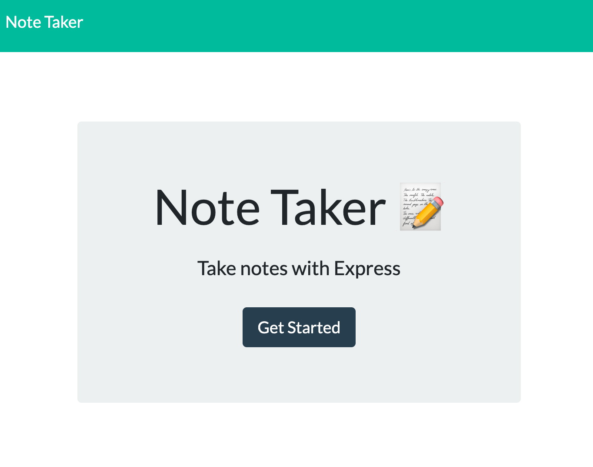

# Homework11
## Express Note Taker

### Description

This node express app was built to help create, save and delete notes for the user.   

### Challenges

All of the bootstrap styling shows up wonderfully.  However, even after double triple checking that i had linked the files appropriately, I could not get the provided styling to work on the two text boxes that the user will input their text.  

### Screen Shots 

### Links

[GitHub](https://github.com/rffrye/Homework11)

[Deployed Heroku app](https://notetaker-rf.herokuapp.com)

### Technologies 

